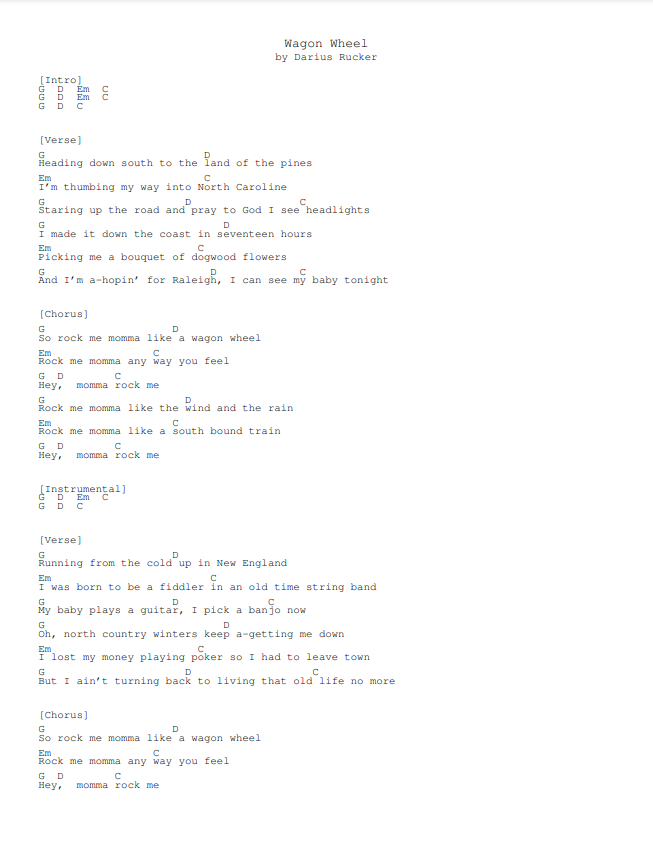

# Nice Tabs

  

A GUI based application that allows users to download Ultimate Guitar tabs and chords into a clean printable PDF. Nice Tabs comes packaged with a stripped down version of LiveTeX so the user is not required to have a LaTeX compiler installed. This was just a program I made for myself but maybe someone else can get some use from it. No promises that it'll work without issue. If you notice anything wrong, please open an issue. Pull requests are appreciated. Running the code is easy, just use pip to install required modules with requirements.txt.

### Installation Instructions
Tested with Windows 10,11. Go to [Nice Tabs v0.4.1-alpha](https://github.com/andrewschalk/Nice-Tabs/releases/tag/v0.4.1-alpha) and download NiceTabs.exe. Windows may suggest the program is a virus, I can assure you it's not, just hit "more info" and "run anyway". You might not be able to run it directly from your browser after downloading. Depending on your system, Nice Tabs could take a long time to open while it unpacks temporary files, this is a work in progress.

### Usage
Simply paste a Ultimate Guitar Tabs URL into the box and hit "create". You will be prompted where to save your PDF.

If the "generate .tex" checkbox is selected, a .tex file of the same name as the PDF will be generated. This allows users with a LaTeX compiler to edit the output. (Note that the .tex file is not very human friendly)

## [An example output](ExampleOutput.pdf)

